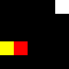
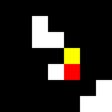

# Experiments Overview

+ Red = snake head
+ Green = snake body
+ Yellow = snake tail
+ White = food
+ Black = empty cell

## Problem p0 (5x5, multifood)

#### Problem Initial State

| Planner                         | Plan Length | Planner Total Time (s) | Rendered Plan |
| -------                         | ----------- |   ---------------      | ------------- |
|  Fast-Forward (FF)              |     29      |       0.1              |   | 
|  Hiearchical Task Network (HTN) |     27      |     0.008530           |  |

## Problem p1 (5x5, single food)

#### Problem Initial State

| Planner                         | Plan Length | Planner Total Time (s) | Rendered Plan |
| -------                         | ----------- |   ---------------      | ------------- |
|  Fast-Forward (FF)              |     41      |       0.03             |   | 
|  Hiearchical Task Network (HTN) |     47      |     0.015784           |  |

## Problem p2 (7x7, multifood)

#### Problem Initial State

| Planner                         | Plan Length | Planner Total Time (s) | Rendered Plan |
| -------                         | ----------- |   ---------------      | ------------- |
|  Fast-Forward (FF)              |     41      |       0.11             |   | 
|  Hiearchical Task Network (HTN) |     35      |     0.020910           |  |
