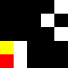

# Experiments Overview

+ Red = snake head
+ Yellow = snake tail
+ White = food
+ Black = empty cell

## Problem p01

#### Problem Initial State

| Planner                         | Plan Length | Planner Total Time (s) | Rendered Plan |
| -------                         | ----------- |   ---------------      | ------------- |
|  Fast-Forward (FF)              |     29      |       0.1              |   | 
|  Hiearchical Task Network (HTN) |     27      |     0.008375           |  |